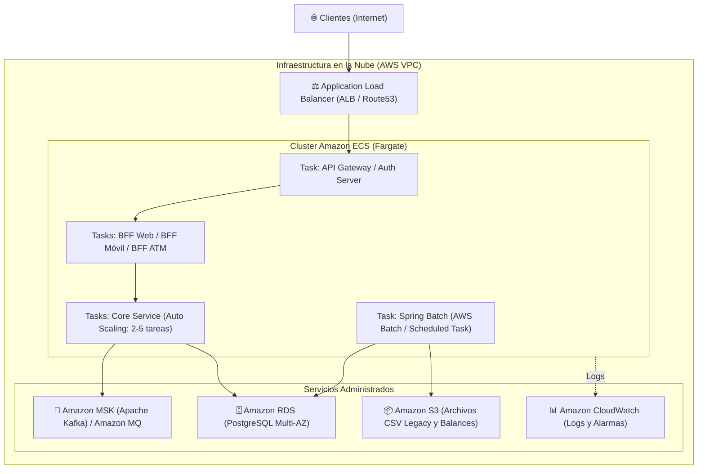

# Pasos para el Despliegue en Entorno Cloud (AWS y Docker Compose) — Banco XYZ

Este documento detalla el procedimiento técnico para contenerizar, orquestar y desplegar la solución en entornos locales y en la nube de Amazon Web Services (AWS).

---

## 1. Despliegue Local con Docker Compose

El archivo `docker-compose.yml` automatiza la compilación de imágenes y la creación de la red bridge aislada `banco-net`.

### 1.1 Pasos para Iniciar Todo el Sistema
1. Asegúrate de compilar previamente los artefactos JAR:
   ```bash
   .\mvnw.cmd clean package -DskipTests
   ```
2. Levantar los 10 contenedores en segundo plano:
   ```bash
   docker compose up -d --build
   ```
3. Verificar el estado de los contenedores:
   ```bash
   docker compose ps
   ```
4. Ver los logs combinados en tiempo real:
   ```bash
   docker compose logs -f
   ```

---

## 2. Escalabilidad Horizontal (Criterio 6)

Para demostrar alta disponibilidad y capacidad de atender picos transaccionales, cualquier servicio puede escalarse horizontalmente sin detener el sistema:

```bash
# Escalar el servicio core a 2 o 3 instancias
docker compose up -d --scale core-service=2

# Escalar el BFF móvil durante un pico de demanda
docker compose up -d --scale bff-movil=3
```

* **Descubrimiento automático:** Eureka detectará dinámicamente las nuevas réplicas en `http://localhost:8761`.
* **Balanceo de carga:** El cliente Feign o RestClient distribuirá las peticiones en formato Round-Robin entre las instancias activas.

---

## 3. Arquitectura y Despliegue en la Nube (AWS)

Para llevar la plataforma a un entorno de producción en AWS, se contemplan dos alternativas estándar:



### 3.1 Procedimiento de Despliegue en Amazon ECS (Fargate)

1. **Creación de Repositorios ECR (Elastic Container Registry):**
   ```bash
   aws ecr create-repository --repository-name bancoxyz/discovery-server
   aws ecr create-repository --repository-name bancoxyz/core-service
   aws ecr create-repository --repository-name bancoxyz/bff-movil
   # ... (un repositorio por cada imagen)
   ```

2. **Etiquetado y Subida de Imágenes:**
   ```bash
   # Iniciar sesión en ECR
   aws ecr get-login-password --region us-east-1 | docker login --username AWS --password-stdin <ACCOUNT_ID>.dkr.ecr.us-east-1.amazonaws.com

   # Tag y Push
   docker tag bancoxyz/core-service:latest <ACCOUNT_ID>.dkr.ecr.us-east-1.amazonaws.com/bancoxyz/core-service:latest
   docker push <ACCOUNT_ID>.dkr.ecr.us-east-1.amazonaws.com/bancoxyz/core-service:latest
   ```

3. **Configuración de AWS Fargate & Task Definitions:**
   * Crear un cluster ECS llamado `banco-xyz-cluster`.
   * Definir cada microservicio como una *Task Definition* con 0.5 vCPU y 1 GB de RAM.
   * Conectar las tareas a una VPC privada con Subnets públicas para el Application Load Balancer (ALB) y Subnets privadas para los microservicios y bases de datos RDS.

4. **Ejecución de los Procesos Batch en la Nube:**
   * Utilizar **AWS Batch** o tareas programadas de ECS (*Scheduled Tasks* con reglas cron de EventBridge) para ejecutar el contenedor `batch-service` de madrugada.
   * Los archivos CSV legacy se leen directamente desde un bucket privado de **Amazon S3** (`s3://bancoxyz-legacy-data/semana_3/`).

---

## 4. Detención y Limpieza del Entorno
Para detener los contenedores y liberar recursos:
```bash
docker compose down -v
```
*(El modificador `-v` elimina los volúmenes temporales para una limpieza completa).*
